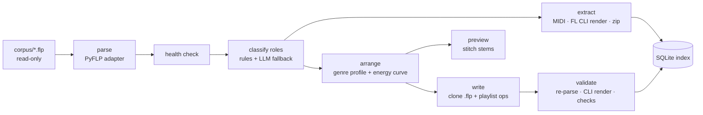
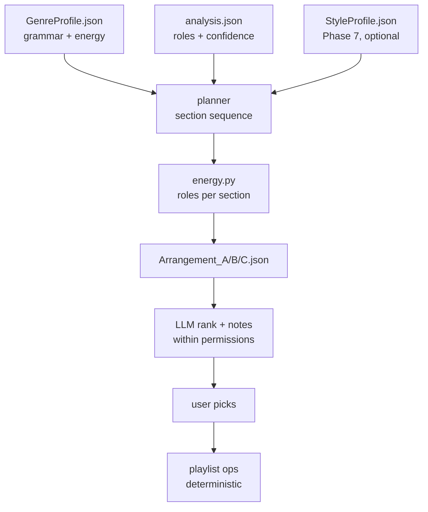

# FLP Finisher — Build Spec & Claude Code Directives

As of 2026-09-20 · Marc

Companion files: `EXECUTE.md` (Phase 0 directive) and `CLAUDE.md` (repo conventions) ship alongside this spec; sections 12 and 13 reproduce them.

## 1. North star, scope, non-goals

FLP Finisher turns an unfinished FL Studio loop into a fully arranged derivative .flp, plus aligned stems and per-role MIDI, without opening the original in FL by hand. AI plans the arrangement; a deterministic engine executes it; FL Studio stays the only renderer.

**v1 = one vertical slice, command line only.** Drop a folder of .flp files → parse → health check → extract (WAV, MP3 preview, per-role MIDI, zipped project) → classify pattern roles → generate 2–3 Level-0 arrangement plans → audition them as stitched audio → write `<name>_FINISHED.flp` → validate by CLI render. The studio PC (Windows, FL Studio, all VSTs and sample drives) is the render host; nothing renders anywhere else.

**v1 success bar:** on a 25-file corpus, ≥ 80% of projects parse, ≥ 80% render from the command line, and at least one 4-bar starter becomes an arrangement you keep and open in FL without re-importing anything. Finishing one real beat end-to-end matters more than any dashboard.

**Non-goals for v1 (explicitly deferred):**

- Tauri/React UI, drop zones, home screens — Phase 8, only after the CLI is in weekly use
- Beat Vault dashboards, genre prediction, audio-similarity search
- Version-family resolution (`beat_v7_final2_REAL.flp` detection)
- Producer Mode (new notes, fills, bass variations, sound replacement)
- macOS support (command-line rendering is reported unreliable there)
- Cloud services, accounts, telemetry, or model training on the catalog

## 2. Principles (hard rules for every agent and every phase)

1. **Originals are immutable.** Source .flp files are read from a read-only corpus path, hashed on scan, and re-hashed after every run. A changed hash fails the run.
2. **FL Studio is the only renderer.** No attempt to synthesize Sytrus/Serum/Kontakt output outside FL. Anything that needs audio goes through the FL command line or a controlled FL session.
3. **AI plans, the engine executes.** An LLM may produce or rank an `ArrangementPlan` (JSON) and label ambiguous patterns. It never touches .flp bytes, playlist positions, or file paths. Deterministic code turns plans into playlist operations.
4. **Permission levels are enforced in code, not in prompts.** Level 0 (arrange only) is the default; the writer refuses any plan operation above the granted level.
5. **Deterministic before probabilistic.** Anything computable (bar math, tiling, density, section lengths, tempo, pitch ranges) is computed. LLM calls are reserved for classification with confidence below threshold and for choosing among generated plans.
6. **Fixtures over assumptions.** Every claim about PyFLP or the FL CLI is verified against the 25-file corpus in Phase 0 before any code depends on it.
7. **CLI before UI.** No desktop app until the CLI has been used weekly for a month.
8. **Native formats out.** Canonical outputs are `.flp`, zipped FL project, WAV stems, and `.mid` files. `project.json` / `arrangement.json` are working data, not a proprietary format anyone must adopt.
9. **Every LLM call is logged** (prompt, response, model, cost) to `DATA/llm_log.jsonl` in the project's output folder.
10. **Founder decisions are surfaced, not guessed.** Unknowns go into `PHASE_REPORT.md` under `FOUNDER DECISION REQUIRED`; the agent picks the reversible default and keeps moving.

## 3. Architecture and repo layout (v1 = Python CLI)

v1 is a single Python package with a Typer CLI, SQLite for the index and job log, and three external dependencies: PyFLP, FL Studio's command line, and ffmpeg. No web server, no Tauri, no React.



Parse feeds everything; the writer only ever clones the parsed original and rewrites its playlist, so plugins, mixer routing, automation and samples survive untouched.

**Repo layout**

```
flp-finisher/
  CLAUDE.md                 repo conventions (section 13)
  EXECUTE.md                current directive (section 12)
  SPEC.md                   this file
  PHASE_REPORT.md           written by the agent at each phase exit
  docs/adr/                 ADR-0001… one per irreversible choice
  prosody_core/
    cli.py                  Typer app: scan, inspect, extract, classify, arrange, preview, build, find, doctor
    model/schemas.py        pydantic: BeatProject, Analysis, ArrangementPlan, GenreProfile, HealthReport
    parse/adapter.py        Backend protocol; pyflp_backend.py; (flpdiff_backend.py later)
    health/check.py         samples, plugins, FL version, render test
    classify/rules.py       heuristics; classify/llm.py for low-confidence cases
    extract/midi.py         per-role .mid via mido
    extract/render_fl.py    FL CLI wrapper (/R /E /F), timeouts, log capture
    extract/stems.py        strategies S1 solo-copy, S2 gui-export (section 5)
    extract/package.py      zipped project + REPORTS/*
    arrange/profiles/*.json genre profiles (data, not code)
    arrange/planner.py      sections → active roles → plan variants
    arrange/energy.py       density targets per section
    arrange/permissions.py  Level 0/1/2 op whitelist
    preview/stitch.py       numpy/soundfile stem stitching → PREVIEW.wav
    write/flp_writer.py     clone + playlist ops via PyFLP save
    validate/validator.py   re-parse, hash, CLI render, duration and RMS checks
    index/db.py             SQLite schema; index/find.py query DSL
  tests/                    unit + corpus tests; golden/ expected values for 5 hand-checked projects
  corpus/                   gitignored; junction/symlink to real .flp folders
  out/                      gitignored; one folder per project (section 4)
```

**CLI surface (v1)**

| Command | Does |
| --- | --- |
| `flpf doctor` | Finds FL64.exe, PyFLP version, ffmpeg; runs a 1-file render smoke test |
| `flpf scan <dir>` | Hashes and parses every .flp, writes `project.json` + index rows, prints parse rate |
| `flpf inspect <flp>` | Human-readable summary: bpm, key guess, bars, patterns, plugins, missing samples |
| `flpf extract <flp> [--stems none\|solo\|gui]` | MIDI, full WAV, MP3 preview, zip, reports, optional stems |
| `flpf classify <flp> [--llm]` | Role labels with confidence into `analysis.json` |
| `flpf arrange <flp> --genre hiphop --structure balanced --level 0 --variants 3` | Writes `Arrangement_A/B/C.json` |
| `flpf preview <arrangement.json>` | Stitches stems into `PREVIEW/<variant>.wav` in seconds, no FL |
| `flpf build <flp> --plan <arrangement.json>` | Clones, writes playlist, saves `_FINISHED.flp`, runs validator |
| `flpf find --bpm 130-150 --has melody,drums --state loop` | Queries the index |

Every command is idempotent and writes only under `out/<project-slug>/`.

## 4. Pipeline stages, inputs, outputs, acceptance criteria

Each stage is a pure function from files in to files out, so any stage can be re-run alone and tested against the corpus.

| Stage | Input | Output | Acceptance (on the 25-file corpus) |
| --- | --- | --- | --- |
| Parse | `.flp` | `DATA/project.json` (BeatProject) | ≥ 80% parse; unknown PyFLP events preserved, never dropped; FL version recorded |
| Health | BeatProject + filesystem | `REPORTS/health.json`, `missing-files.txt`, `plugins.txt` | Every referenced sample resolved to found/missing; plugin list complete; render smoke test pass/fail recorded |
| Classify | BeatProject (+ stems if present) | `DATA/analysis.json` (roles with confidence) | ≥ 90% agreement with the 5 hand-labelled golden projects; LLM used only when rule confidence < 0.70 |
| Extract MIDI | BeatProject | `MIDI/<nn>_<Role>.mid` per role, PPQ from project | Re-import into a blank FL project plays identically to the pattern; note count matches |
| Extract audio | `.flp` + FL CLI | `PREVIEW/Full.wav`, `PREVIEW/Full.mp3` | Duration within 2% of bars × 4 × 60 / bpm; non-silent; MP3 only for listening, never for alignment |
| Package | `.flp` + samples | `<name>.zip` | Zip opens in FL on a second machine profile with 0 missing samples (third-party plugins excluded) |
| Arrange | Analysis + GenreProfile (+ StyleProfile later) | `ARRANGEMENT/Arrangement_{A,B,C}.json` | Plans validate against schema and Level-0 permissions; sections sum to target length ± 8 bars |
| Preview | Plans + stems | `PREVIEW/Arrangement_{A,B,C}.wav` | Produced in < 10 s per variant with no FL involvement |
| Write | Original `.flp` + chosen plan | `<name>_FINISHED.flp` | Original hash unchanged; output re-parses; pattern, channel, plugin, mixer counts equal the original |
| Validate | `_FINISHED.flp` | `REPORTS/validation.json` | CLI render succeeds; duration matches plan; per-section RMS non-silent where roles are active |
| Index | everything above | SQLite rows | `flpf find` answers bpm/role/state queries in < 1 s over 1,000 projects |

**Output folder per project** (mirrors the native-formats principle):

```
out/<slug>/
  <name>_FINISHED.flp        hero output (Phase 5+)
  <name>_FINISHED.zip        portable package
  PREVIEW/  Full.wav  Full.mp3  Arrangement_A.wav …
  STEMS/    Melody.wav  Chords.wav  Bass.wav  Kick.wav  Snare.wav  Hats.wav  Perc.wav
  MIDI/     01_Chords.mid  02_Melody.mid  03_Counter.mid  04_Bass.mid  05_Kick.mid …
  DATA/     project.json  analysis.json  llm_log.jsonl
  ARRANGEMENT/  Arrangement_A.json  Arrangement_B.json  Arrangement_C.json
  REPORTS/  health.json  validation.json  missing-files.txt  plugins.txt
```

## 5. Stem extraction strategies and decision rule

FL's command line renders whole projects, folders, and MIDI, but exposes no split-mixer-tracks switch, so stems need one of two workarounds. Both are built as strategies behind one interface (`StemStrategy.render(project, out_dir) -> list[StemFile]`), and Phase 0 decides which becomes the default.

| Strategy | How | Pros | Cons | Kill criteria |
| --- | --- | --- | --- | --- |
| **S1 solo-copy** | PyFLP writes N derived `.flp` files, each with one role's mixer track (or channels) unmuted; `FL64.exe /R /Ewav /F<tmpdir>` renders the folder in one call | Pure CLI, headless, parallel-safe, no GUI | N renders per project; needs PyFLP save to round-trip; send/master FX bleed unless master effects are bypassed in the copy | PyFLP save fails or changes the project on ≥ 2 of 25 corpus files |
| **S2 gui-export** | pywinauto opens the project in FL, drives File → Export → Wave file with **Split mixer tracks** checked, waits for completion (the existing AutoHotkey batch-export project shows the exact click path) | Native FL stems, one render, exact routing | Needs an interactive desktop session, breaks on dialog changes, serial only | Fails on ≥ 3 of 10 test runs after tuning |
| **S3 manual** | User exports stems once; `flpf extract --stems import <dir>` ingests them | Always works | Defeats the purpose | Fallback only |

Decision rule: if S1 passes on ≥ 23 of 25 corpus files, S1 is the default and S2 is optional. Otherwise S2 is the default on the studio PC and S1 is disabled until PyFLP save is trusted.

Rules that apply to every strategy:

- WAV only for stems (24-bit, project sample rate); MP3 adds leading silence and breaks alignment
- Stem names come from role labels (`Kick.wav`), not mixer numbers; a role with two sources gets `Kick_1.wav`, `Kick_2.wav`
- A stem bundle is rejected if any file's duration differs from `Full.wav` by more than 1 ms
- Stems are rendered from the **original loop**, then tiled by the preview and by Stem Mode, never re-rendered per arrangement

## 6. Arrangement engine

Genre is data, not a prompt: a `GenreProfile` JSON defines the section grammar and energy targets, the planner turns it into 2–3 deterministic `ArrangementPlan` variants, and the LLM only ranks and annotates within the granted permission level.



The planner is seeded, so the same inputs always yield the same variants; the LLM's ranking is advisory and logged.

**Genre profiles (v1 ships two; others are copies of the schema)**

| Genre | Section grammar | Energy targets (intro / verse / hook / bridge / outro) | Notes |
| --- | --- | --- | --- |
| hiphop | intro 4 · hook 8 · verse 16 · hook 8 · verse 16 · bridge 8 · hook 16 · outro 4 | 0.30 / 0.55 / 0.90 / 0.45 / 0.30 | 808 enters with first hook; drum dropout on last bar before each hook |
| rnb | intro 8 · verse 16 · pre 4 · chorus 8 · verse 16 · pre 4 · chorus 8 · bridge 8 · chorus 8 · outro 8 | 0.25 / 0.50 / 0.85 / 0.40 / 0.25 | Longer intro, chords lead, percussion thinned in verses |

Structure presets scale the grammar: `short` caps at ~2:15, `balanced` is the grammar as written, `full` doubles the final hook and adds a second bridge.

**Energy → active roles.** Each role carries a weight (kick 0.20, snare 0.15, hats 0.10, bass 0.20, chords 0.15, melody 0.15, counter 0.10, perc 0.05, fx 0.05). For a section with target density d, the engine activates roles in priority order until the weight sum reaches d, with genre-specific overrides (e.g. bass never before first hook in hiphop). Dropouts remove drums for the last 1–2 bars before a section boundary.

**Permission levels (enforced by `permissions.py`, default 0)**

| Level | Allowed operations | Forbidden |
| --- | --- | --- |
| 0 Arrange only | place/tile existing patterns, mute per section, duplicate patterns, dropouts, section lengths, intro/outro | any note edit, any mixer edit |
| 1 Conservative | Level 0 + remove notes, halve/double a pattern, octave shift, velocity scaling, simplified 808, fills built from existing drum notes | new pitches, new sounds |
| 2 Producer assist | Level 1 + counter-melody, B-section, alternate 808, transitions, extended voicings | sound replacement without approval |

**Plan → playlist operations (Level 0).** For each section and each active role: tile the role's pattern across the section on its own playlist track, at pattern-length granularity; add a dropout by omitting the final repetition of drum roles; name playlist tracks by role; write a time marker per section. Anything the writer cannot express at the current PyFLP capability (clip trimming, offsets) is reported, not faked.

## 7. Data contracts

Five pydantic models are the shared contract between every agent, stage and test; each is serialized as JSON in `DATA/` or `ARRANGEMENT/`, and a schema change requires an ADR.

```json
{
  "BeatProject": {
    "id": "sha256 of the source .flp",
    "source_path": "corpus/2023/Starfall.flp",
    "fl_version": "21.2.3",
    "tempo": 142.0,
    "ppq": 96,
    "time_signature": [4, 4],
    "length_bars": 4,
    "key_guess": {"root": "F#", "mode": "minor", "confidence": 0.71},
    "channels": [{"index": 0, "name": "Omnisphere", "kind": "plugin|sampler|layer|automation", "plugin": "Omnisphere", "sample_path": null, "mixer_track": 3}],
    "patterns": [{"index": 1, "name": "Pattern 1", "length_ticks": 1536, "notes": [{"channel": 0, "position": 0, "length": 96, "key": 60, "velocity": 100}]}],
    "mixer": [{"index": 3, "name": "Keys", "effects": ["Fruity Reeverb 2"], "routes_to": [0]}],
    "playlist": [{"track": 1, "pattern": 1, "start_ticks": 0, "length_ticks": 1536}],
    "markers": [],
    "samples": [{"path": "D:/Drums/Snare21.wav", "found": false}],
    "parse_warnings": []
  },
  "Analysis": {
    "project_id": "…",
    "state": "loop|partial|arranged|empty|broken",
    "roles": [{"pattern": 1, "channel": 0, "role": "chords", "confidence": 0.93, "method": "rules|llm|user"}],
    "has": {"melody": true, "chords": true, "bass": true, "kick": true, "snare": true, "hats": true, "counter": false},
    "completion_estimate": 0.82
  },
  "ArrangementPlan": {
    "variant": "A",
    "genre": "hiphop",
    "structure": "balanced",
    "level": 0,
    "seed": 1234,
    "tempo": 142.0,
    "total_bars": 80,
    "sections": [{"name": "intro", "start_bar": 1, "bars": 4, "energy": 0.30, "active_roles": ["chords", "melody"], "dropout_bars": 0}],
    "ops": [{"op": "tile", "role": "chords", "pattern": 1, "start_bar": 1, "bars": 4}],
    "llm_notes": "optional, advisory"
  },
  "GenreProfile": {
    "genre": "hiphop",
    "grammar": {"balanced": ["intro:4", "hook:8", "verse:16", "hook:8", "verse:16", "bridge:8", "hook:16", "outro:4"]},
    "energy": {"intro": 0.30, "verse": 0.55, "hook": 0.90, "bridge": 0.45, "outro": 0.30},
    "role_weights": {"kick": 0.20, "snare": 0.15, "hats": 0.10, "bass": 0.20, "chords": 0.15, "melody": 0.15, "counter": 0.10, "perc": 0.05, "fx": 0.05},
    "rules": ["bass.first_entry == first(hook)", "drums.dropout_before(hook) == 1"]
  },
  "HealthReport": {
    "project_id": "…",
    "fl_compatible": true,
    "samples": {"found": 26, "missing": 2, "relinked": 0},
    "plugins": [{"name": "Serum", "available": true}],
    "render_test": "pass|fail|skipped",
    "recommended_mode": "native|stem"
  }
}
```

Role vocabulary is closed: `chords, melody, counter, bass, kick, snare, hats, perc, fx, vocal, unknown`. `StyleProfile` (Phase 7) reuses `GenreProfile`'s shape with medians measured from finished projects instead of hand-set values.

## 8. Test corpus and validator

The corpus is 25 real .flp files you pick before any code is written, and every phase's exit criteria are measured against it, never against synthetic projects.

**Corpus composition**

| Slice | Count | Purpose |
| --- | --- | --- |
| 4-bar starters, 2019–2026, spread across FL versions | 12 | the core use case; must span every FL version you have saved with |
| 8–16 bar loops with partial playlist | 5 | tests `state` detection and "arranged vs loop" logic |
| Finished beats | 5 | golden arrangements for the validator and, later, StyleProfile |
| Known-broken (missing samples, dead plugins) | 3 | health check and Stem Mode routing |

Five of the starters get a hand-written `golden/<slug>.json`: tempo, bar count, pattern count, and role label per pattern. Classification accuracy is measured only against these five.

**Validator checks on every `_FINISHED.flp`** (all must pass, all reported in `REPORTS/validation.json`)

1. Original `.flp` hash unchanged
2. Output re-parses with the same backend; channel, pattern, plugin and mixer counts equal the original
3. Playlist length in bars equals `ArrangementPlan.total_bars`
4. CLI render exits 0 within timeout (default 10 min) and produces a WAV
5. Rendered duration within 2% of `total_bars × 4 × 60 / tempo`
6. Per-section RMS above −60 dBFS where any role is active; below −60 dBFS in any section planned as silent
7. First-onset alignment: the first hook's downbeat lands within 5 ms of the planned bar

**Test tiers in `tests/`**

- Unit: schemas, bar math, energy → roles, permissions whitelist, MIDI tick conversion (no files, runs in CI)
- Corpus: parse/health/classify/MIDI over all 25 (needs the corpus, runs locally)
- Render: FL CLI stages, gated behind `FLPF_RENDER=1` (studio PC only, never CI)

A phase cannot be tagged while any tier that applies to it is red.

## 9. Phases, exit criteria, git tags

Phases 0–5 are the product; nothing after Phase 5 starts until you have finished one real beat with it.

| Phase | Builds | Exit criteria (measured on the corpus) | Tag |
| --- | --- | --- | --- |
| 0 Spikes + scaffold | repo, `doctor`, three spikes: PyFLP parse rate, FL CLI render (file, folder, MIDI), stem strategies S1 vs S2 on one project | `PHASE_REPORT.md` with parse rate, render rate, S1/S2 verdict, PyFLP save round-trip result; go/no-go decision recorded | `flpf-v0.0-spikes` |
| 1 Reader | `scan`, `inspect`, BeatProject, SQLite index | ≥ 80% parse; 5 golden projects match on tempo, bars, pattern count | `flpf-v0.1-reader` |
| 2 Extractor | `extract`: per-role MIDI, Full.wav/mp3, zip, health report | MIDI re-imports cleanly; ≥ 80% render; health report on all 25 | `flpf-v0.2-extractor` |
| 3 Classifier | rules + LLM fallback, `analysis.json`, `find` | ≥ 90% role agreement on golden five; < 30% of patterns need the LLM | `flpf-v0.3-classifier` |
| 4 Arranger + Preview | hiphop + rnb profiles, planner, energy, permissions, stitched previews | 3 variants per starter; previews in < 10 s; you rate ≥ 1 of 3 as "would keep" on 5 starters | `flpf-v0.4-arranger` |
| 5 Writer + Validator | clone `.flp`, playlist ops, `build`, all 7 validator checks | 5 starters produce `_FINISHED.flp` that open in FL and pass validation; **one beat you actually finish** | `flpf-v0.5-finisher` |
| 6 Stems automated | chosen strategy productionized, `--stems` default, Stem Mode arrangements | ≥ 90% stem success on corpus; Stem Mode build passes validation on the 3 broken projects | `flpf-v0.6-stems` |
| 7 Style learning | StyleProfile from the 5 finished beats, planner reads it | Variant ranked #1 by you matches StyleProfile-influenced variant ≥ 60% of the time | `flpf-v0.7-style` |
| 8 UI | Tauri shell over the CLI: drop → genre → Finish Beat, advanced behind `•••` | Only after a month of weekly CLI use | `flpf-v0.8-ui` |
| 9 Producer Mode / Vault | Level 1–2 ops, version families, catalog views | Deferred; needs its own spec | — |

Each phase is one branch, one PR, one tag, one `PHASE_REPORT.md` update. Phases 2 and 3 can run in parallel on separate branches; nothing else overlaps.

## 10. Risks and mitigations

The two risks that can kill the project are both parser risks, which is why Phase 0 measures them before anything else is built.

| Risk | Likelihood | Impact | Mitigation |
| --- | --- | --- | --- |
| PyFLP fails on newer FL versions in the corpus | High | Blocks everything | Backend adapter from day one; evaluate flpdiff (TypeScript, clean-room, 2026) as second backend; corpus spans all FL versions you save with |
| PyFLP save corrupts or subtly changes projects | Medium | Blocks Writer and S1 | Round-trip test (parse → save → parse → diff) on all 25 in Phase 0; validator check 2; S2 as stem fallback; manual arrangement map as Writer fallback |
| FL CLI switches differ from forum descriptions (`/R`, `/E`, `/F` verified; MIDI switch letter not) | Medium | Delays Extractor | `doctor` confirms each switch on a 1-file smoke test against the local manual page (`fformats_save_export.htm#commandline_export`) |
| CLI render needs an interactive Windows session | High | Scheduling only | Run the render worker as a logged-in user task (Task Scheduler, "run only when user is logged on"); never as a service |
| Render times for VST-heavy projects | Medium | Throughput | Timeouts per project, resumable queue in SQLite, overnight batch mode |
| Send/master FX bleed in S1 stems | Medium | Stem quality | Bypass master and send effects in derived copies (config flag `stems.dry_master`) |
| Pattern names are meaningless (`Pattern 3`, `asdf`) | Certain | Classifier accuracy | Rules use pitch range, polyphony, density, channel kind, sample filename, plugin; LLM fallback with confidence; `flpf classify --fix` lets you correct labels once, stored as `method: user` |
| Scope creep into Vault / UI | High | Never finishing a beat | Non-goals in section 1; Phase 8 gate; every PR must cite a phase |
| Two agents editing the same files | Medium | Merge chaos | One branch per phase, one agent per branch (section 14) |
| Missing samples on old projects | High | Render failures | Health check + relink by filename/hash search across configured drives (Phase 2), Stem Mode for the rest |

## 11. Founder decisions required

These ten decisions gate Phase 0; each has a default the agent will use if you don't answer, and every default is reversible.

| # | Decision | Default if unanswered |
| --- | --- | --- |
| 1 | Working name / repo name | `flp-finisher`; product name TBD |
| 2 | Corpus location and the 25 files | Agent lists candidates by FL version and mtime; you confirm |
| 3 | Studio PC OS and FL Studio version(s) | Windows, latest installed FL; recorded by `doctor` |
| 4 | Where `out/` lives (fast SSD, not the corpus drive) | `D:/FLPF/out` |
| 5 | Stems dry (master/send FX bypassed) or through master | Dry, with `--wet` flag |
| 6 | v1 genres | hiphop + rnb |
| 7 | LLM for classification/ranking | Claude API via key in `.env`; Codex as optional second opinion, never both on one call |
| 8 | Preview format for auditioning | WAV + MP3 side by side |
| 9 | Whether this lives under Inceptive / MZA Audio or as a standalone repo | Standalone repo; import into Inceptive canon after Phase 5 |
| 10 | Priority vs. BTZ (P1) | Phase 0 only (a weekend); Phases 1–5 wait for an explicit go |

## 12. EXECUTE.md — directive for Claude Code (copy into repo root)

This is the Phase 0 directive; when Phase 0 is tagged, replace the PHASE block with Phase 1's tasks from section 9 and keep everything else. Shipped as the separate file `EXECUTE.md`.

```markdown
# EXECUTE.md — FLP Finisher, Phase 0

You are building FLP Finisher: a local Python CLI that turns unfinished FL Studio
.flp loops into arranged derivative projects, stems and per-role MIDI. SPEC.md is
the contract. CLAUDE.md has repo conventions. Read both before writing code.

## Mission for this phase
Produce PHASE_REPORT.md with measured answers to four questions, plus the repo
scaffold. Do not build features beyond what the spikes need.

1. What fraction of the 25-file corpus does PyFLP parse? (target ≥ 80%)
2. Does PyFLP save round-trip losslessly? (parse → save → parse → structural diff)
3. Does the FL command line render a file, a folder, and MIDI on this machine?
4. Which stem strategy works here, S1 solo-copy or S2 gui-export?

## Hard rules (never break, never ask to break)
- corpus/ is read-only. Never write, move, rename or "fix" anything in it.
  Hash every file at scan; re-hash at the end of every command; fail on change.
- All outputs go under out/<slug>/. Nothing else on disk is touched.
- FL Studio is the only renderer. Never emulate plugins or guess audio.
- LLM calls: none in Phase 0. Later phases log every call to DATA/llm_log.jsonl.
- Anything you cannot verify goes in PHASE_REPORT.md under
  "FOUNDER DECISION REQUIRED" or "UNVERIFIED". Pick the reversible default and
  continue; do not stop to ask.
- No UI, no web server, no Tauri, no React, no Docker.
- No GUI automation runs unless FLPF_GUI=1 is set in the environment.
- No render runs unless FLPF_RENDER=1 is set (studio PC only).
- Do not add a dependency without a one-line reason in pyproject.toml comments.
- Code wins over documentation when they disagree; note the disagreement in the report.

## Tasks, in order

### T0 Scaffold
- python 3.12, uv or pip, pyproject.toml, package `prosody_core`, Typer CLI `flpf`
- deps: pyflp, mido, numpy, soundfile, pydantic>=2, typer, rich, sqlite (stdlib)
- tests/ with pytest; tiers: unit (always), corpus (needs corpus/), render (FLPF_RENDER=1)
- `flpf doctor`: locate FL64.exe (registry + default paths), print PyFLP version,
  ffmpeg presence, corpus file count, and the FL manual's command-line switches it
  will use. Exit non-zero if FL is not found and FLPF_RENDER=1.
- docs/adr/ADR-0001-parser-backend.md: PyFLP behind a Backend protocol; flpdiff
  listed as candidate second backend.

### T1 Spike: parse rate
- `flpf scan corpus/` → for each .flp: sha256, FL version (from header), tempo,
  ppq, pattern count, channel count, playlist item count, parse ok/error.
- Write out/scan_report.csv and a summary table in PHASE_REPORT.md grouped by FL
  version. Record every exception verbatim in out/scan_errors.log.
- Keep unknown PyFLP events; never drop them.

### T2 Spike: save round-trip
- For each parsed file: pyflp.save() to out/<slug>/roundtrip.flp, parse it back,
  diff: counts of channels, patterns, notes, playlist items, mixer inserts,
  plugin names, sample paths. Report byte-size delta and any structural diff.
- Verdict per file: lossless / changed / failed. Aggregate in PHASE_REPORT.md.

### T3 Spike: FL command line (only with FLPF_RENDER=1)
- Confirm the exact switches from the local manual page
  (FL Studio manual → Save/Export → "command line"). Verified so far:
  /R[filename] renders a project, /E<fmt,fmt> picks formats, /F<folder> renders
  every .flp in a folder. The MIDI export switch exists; confirm its letter and
  record it.
- Run three renders with timeouts and captured stdout/stderr:
  1. one project → wav+mp3   2. a temp folder of 3 projects → wav   3. MIDI export
- Report wall time per project, exit codes, output paths, duration vs expected
  (bars × 4 × 60 / bpm), and whether FL leaves a process running afterwards.

### T4 Spike: stems, S1 vs S2 (one project, FLPF_RENDER=1)
- S1: using PyFLP, write N copies with all but one mixer track (or channel group)
  muted; render the folder with /R /Ewav /F; check N stems exist, equal length,
  non-silent, and that mixing them back approximates Full.wav (null test, report
  peak residual in dB).
- S2 (only with FLPF_GUI=1): pywinauto script that opens the project, drives
  File → Export → Wave file with "Split mixer tracks" checked, waits, and lists
  the resulting files. Reference: the open-source AutoHotkey FL batch-export
  script for the click path. Ten runs; report pass count.
- Verdict per SPEC section 5's kill criteria.

### T5 PHASE_REPORT.md
Sections, in this order: Summary (four answers, one line each) · Parse rate table
by FL version · Round-trip verdicts · CLI render results · Stem strategy verdict ·
UNVERIFIED · FOUNDER DECISION REQUIRED · Recommendation: go / no-go for Phase 1,
and which backend and stem strategy to build on.

## Definition of done
- `flpf doctor` and `flpf scan corpus/` run clean on the studio PC
- unit tier green; corpus tier green or failures explained in the report
- PHASE_REPORT.md complete; git tag flpf-v0.0-spikes on branch phase-0
- No file in corpus/ changed (hashes match)

## How to report progress
One line per task in PHASE_REPORT.md as it lands. No narrative in commit
messages beyond "T2: round-trip diff, 23/25 lossless". Surface blockers in the
report, then move to the next task.
```

## 13. CLAUDE.md — repo conventions (copy into repo root)

CLAUDE.md stays short and stable across phases; phase-specific instructions live in EXECUTE.md. Shipped as the separate file `CLAUDE.md`.

```markdown
# CLAUDE.md — FLP Finisher

## What this is
Local Python CLI (`flpf`) that parses FL Studio .flp projects, extracts MIDI and
audio, classifies pattern roles, plans arrangements, and writes derivative .flp
files. SPEC.md is the contract; EXECUTE.md is the current phase's directive.

## Read first
SPEC.md sections 2 (principles), 7 (schemas), and the current EXECUTE.md.

## Non-negotiables
- corpus/ is read-only; hash-verify on every run
- outputs only under out/<slug>/
- FL Studio renders; code never synthesizes audio
- LLM plans and labels; deterministic code executes; permissions enforced in
  prosody_core/arrange/permissions.py, not in prompts
- every LLM call logged to DATA/llm_log.jsonl (model, prompt, response, cost)
- no UI code before Phase 8

## Environment flags
FLPF_RENDER=1  enables FL command-line rendering (studio PC only)
FLPF_GUI=1     enables pywinauto stem export (interactive session only)
FLPF_LLM=off   disables LLM fallbacks (default in tests)

## Conventions
- Python 3.12, pydantic v2 models in prosody_core/model/schemas.py are the only
  data contract; changing one requires docs/adr/ADR-NNNN
- Typer commands are thin: parse args → call one function in the stage module
- Stage functions are pure: (paths/models in) → (paths/models out); no globals
- Backend protocol in prosody_core/parse/adapter.py; never import pyflp outside
  parse/ and write/
- Ticks everywhere internally; bars only at the CLI and plan boundary
- Role vocabulary is closed: chords, melody, counter, bass, kick, snare, hats,
  perc, fx, vocal, unknown
- Logging: rich console + out/<slug>/REPORTS/run.log; no print()
- Tests: tests/unit (always), tests/corpus (needs corpus/), tests/render
  (FLPF_RENDER=1); pytest markers `corpus` and `render`
- One branch per phase (phase-N), one PR, one tag flpf-v0.N-<name>
- Commit messages: "T<n>: <what changed>, <measured result>"

## Commands
uv sync                      install
flpf doctor                  environment check
pytest -m "not corpus and not render"   unit tier
pytest -m corpus             corpus tier
FLPF_RENDER=1 pytest -m render          render tier (studio PC)

## When unsure
Pick the reversible default, record it under FOUNDER DECISION REQUIRED in
PHASE_REPORT.md, keep going. Never modify corpus/ to make a test pass.
```

## 14. Codex / Claude Code division of labor

Split by branch and phase, not by "engineering vs. music intelligence": both agents read the same SPEC.md, schemas and corpus, and only one agent owns a branch at a time.

| Work | Owner | Reviewer | Why |
| --- | --- | --- | --- |
| Phase 0 spikes, scaffold, ADR-0001 | Claude Code | Codex reads PHASE_REPORT.md and challenges the go/no-go | One agent must own the corpus facts end to end |
| Phase 1 Reader, Phase 2 Extractor (render worker, MIDI, zip) | Codex | Claude Code | File plumbing, subprocess handling, retries: mechanical, testable |
| Phase 3 Classifier rules + LLM fallback | Claude Code | Codex | Musical heuristics and prompt design |
| Phase 4 Arranger, profiles, energy, permissions, preview | Claude Code | Codex | Plan semantics and permission enforcement must stay coherent |
| Phase 5 Writer + Validator | Codex builds writer; Claude Code builds validator on a separate branch | swapped | Independent implementations catch each other's assumptions |
| Phase 6 Stems (chosen strategy) | Codex | Claude Code | Automation and process control |
| Phase 7 StyleProfile | Claude Code | Codex | Statistics with musical judgment |

Rules that make this work:

- The reviewer never pushes to the owner's branch; review is a written list in the PR, and the owner applies it
- Phases 2 and 3 may run in parallel because they touch disjoint modules (`extract/` vs `classify/`); every other phase is serial
- Any change to `model/schemas.py` is made by the phase owner only after an ADR, and the other agent is told in the PR description
- Golden files and the corpus are yours; neither agent creates, edits or "repairs" them
- You are the tie-break on every FOUNDER DECISION REQUIRED item; agents do not resolve them for each other
